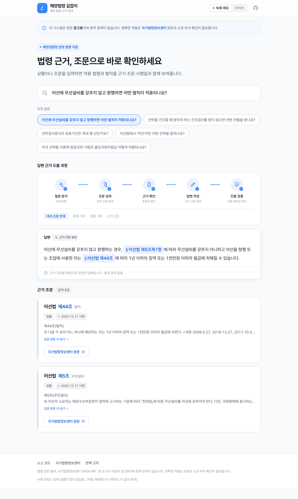
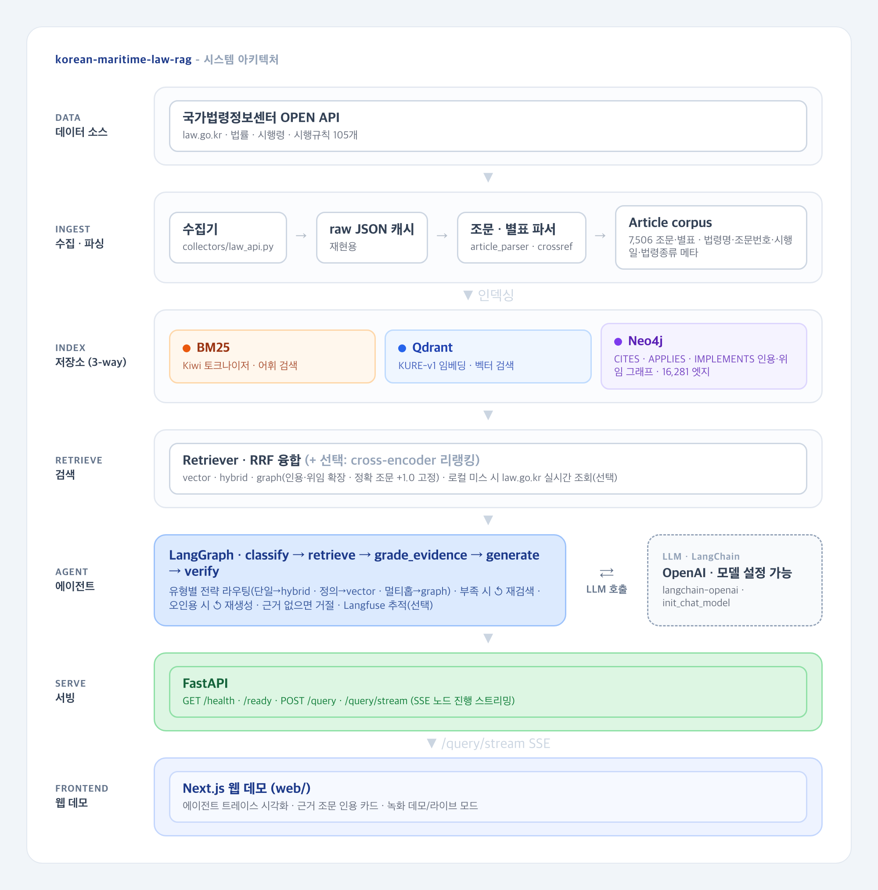

# 해양 법령 RAG

해양 관련 법령을 조문 단위로 검색하고, 답변에 사용한 근거 조문을 함께 보여주는 RAG 프로젝트입니다.

법령 질의는 일반 문서 검색과 조금 다릅니다. 법령명과 조문 번호가 직접 들어오는 질문도 있고, 법률 조문이 시행령이나 시행규칙으로 이어지는 질문도 있습니다. 그래서 이 프로젝트는 BM25, 벡터 검색, 조문 관계 그래프를 각각 만들고 검색 결과를 합치는 방식으로 구성했습니다.



검색·생성 과정을 단계별로 보여주는 [웹 데모](web/)입니다. 실제 실행을 녹화해 키 없이 재생하고, 로컬에서는 라이브 모드로 백엔드에 직접 질의할 수 있습니다.

## 구현 범위

- 국가법령정보센터 OPEN API 응답을 조문과 별표 단위로 파싱
- 법령명, 조문 번호, 시행일, 법령 종류를 포함한 `Article` 모델 구성
- 조문 본문에서 명시 인용, 준용, 법률-시행령/시행규칙 위임 관계 추출
- BM25, Qdrant 벡터 검색, Neo4j 그래프 확장 검색 구현
- RRF 기반 검색 결과 병합과 선택형 cross-encoder 재정렬
- LangGraph 기반 답변 흐름 구성: 질문 분류, 검색, 근거 평가, 재검색, 답변 생성, 인용 검증
- FastAPI 질의 API와 SSE 스트리밍 API 제공
- Langfuse 추적, law.go.kr 실시간 조회, 개정 감지와 증분 재색인은 선택 기능으로 분리
- 검색·생성 과정을 단계별로 보여주는 Next.js 웹 데모: 에이전트 트레이스 시각화, 근거 조문 인용 카드, 녹화/라이브 모드

## 아키텍처



```text
law.go.kr
  -> 원문 JSON 캐시
  -> 조문 파서 / 인용 관계 파서
  -> BM25 + Qdrant + Neo4j
  -> RRF 병합 + 선택형 리랭커
  -> LangGraph 답변 흐름
  -> FastAPI
```

검색은 세 경로를 나눠 사용합니다.

| 경로 | 쓰임 |
|---|---|
| BM25 | 법령명, 조문 번호, 명시 키워드처럼 표면형이 중요한 질문 |
| 벡터 검색 | 질문과 조문 본문의 의미가 가까운 후보 검색 |
| 그래프 검색 | `CITES`, `APPLIES`, `IMPLEMENTS` 관계를 이용한 주변 조문 확장 |

상세 설계는 [docs/architecture.md](docs/architecture.md)에 정리했습니다.

## 기술 스택

| 영역 | 사용 기술 |
|---|---|
| 언어 / API | Python 3.12, FastAPI |
| 검색 | rank-bm25, Qdrant, Neo4j, RRF |
| 한국어 처리 | Kiwi, KURE-v1 |
| LLM 흐름 | LangChain, LangGraph |
| 관측성 | Langfuse |
| 평가 / 품질 | pytest, ruff, mypy, 자체 골드셋 평가 스크립트 |
| 프론트엔드 | Next.js, React, TypeScript, Tailwind CSS |

## 실행 방법

필요한 도구는 Python 3.12, uv, Docker입니다.

```bash
uv sync
make test

make up
uv sync --extra ml
make index

uv run python scripts/search.py "선박검사를 받지 않으면 어떤 처벌을 받나요?"
```

답변 생성과 생성 품질 평가는 OpenAI API 키가 필요합니다.

```bash
OPENAI_API_KEY=... uv run python scripts/ask.py "건조검사를 받지 않으면 어떤 처벌을?"
OPENAI_API_KEY=... uv run uvicorn korean_maritime_law_rag.serving.app:app
```

선택 기능은 환경변수로 켭니다.

| 기능 | 설정 또는 명령 |
|---|---|
| 리랭커 | `MLR_RERANK=true` |
| Langfuse 추적 | `uv sync --extra obs`, `MLR_LANGFUSE_ENABLED=true` |
| law.go.kr 실시간 조회 | `MLR_ENABLE_LAW_API_FALLBACK=true`, `MLR_LAW_OC=...` |
| 시행일 기준 필터 | `MLR_AS_OF=YYYYMMDD` |
| 임베딩 캐시 생성 | `uv run python scripts/embed_corpus.py` |
| 개정 감지와 증분 재색인 | `MLR_LAW_OC=... uv run python scripts/poll_amendments.py --reindex` |

로컬 Langfuse는 `make up`으로 함께 실행됩니다. 애플리케이션에서 추적을 보낼지는 `MLR_LANGFUSE_ENABLED` 값으로 결정합니다.

### 웹 데모

검색·생성 과정을 시각화하는 프론트엔드는 `web/`에 있습니다.

```bash
cd web
npm install
npm run dev   # http://localhost:3000
```

기본은 실제 실행을 녹화한 데모를 키 없이 재생합니다. 라이브 모드는 위 `uvicorn` 백엔드를 띄운 뒤 화면 우상단에서 전환하면 로컬 백엔드에 직접 질의합니다. 데모에 쓰는 질의·응답은 `scripts/capture_demo_traces.py`로 다시 생성할 수 있습니다.

## 평가

평가는 `tests/qa_pairs.yaml`의 내부 골드셋 180개 질의로 재현할 수 있습니다. 정답 조문이 있는 질문은 154개, 근거가 없어 거절해야 하는 질문은 26개입니다.

코퍼스 규모:

| 항목 | 값 |
|---|---:|
| 법령 문서 | 105 |
| 조문·별표 | 7,506 |
| 그래프 엣지 | 16,281 |
| 평가 질의 | 180 |

검색 전략 비교(KURE-v1, 리랭커 끔):

| 전략 | hit@1 | hit@5 | recall@10 |
|---|---:|---:|---:|
| 벡터 검색 | 0.539 | 0.844 | 0.896 |
| 하이브리드 | 0.455 | 0.844 | 0.909 |
| 그래프 검색 | 0.279 | 0.890 | 0.945 |

현재 결과에서는 벡터 검색이 1순위 정답률에서 가장 안정적이었고, 그래프 검색은 정답 후보를 넓히는 데 더 강했습니다. 리랭커를 켜면 세 전략의 차이가 줄어듭니다.

### 지연과 비용

답변 생성까지 포함한 end-to-end 지연과 질의당 비용입니다. 에이전트는 `gpt-4o-mini`로 동작하고, 생성 품질을 평가하는 judge 모델만 `gpt-4o`로 분리했습니다.

| 항목 | 값 |
|---|---:|
| end-to-end 지연 | p50 6.2초 · p95 12.5초 (골드셋 180문항) |
| 질의당 입력·출력 토큰(평균) | 5,635 · 202 (답변 가능 문항 중 18건 실측) |
| 질의당 비용(추정) | 약 $0.001 (약 1.4원, OpenAI 공개 단가 기준) |

지연 결과는 `reports/latency.json`, 비용 결과는 `reports/cost.md`에 저장되어 있습니다. 토큰 수는 실측값이고 비용은 공개 단가를 곱한 추정치라, 단가가 바뀌면 아래 `measure_cost.py`로 다시 계산하면 됩니다.

재현 명령:

```bash
uv run python scripts/validate_gold.py
uv run python scripts/significance.py
OPENAI_API_KEY=... uv run python scripts/evaluate_all.py
OPENAI_API_KEY=... uv run python scripts/measure_cost.py
```

전략별 통계 검정(Wilson CI·McNemar)은 [reports/significance.md](reports/significance.md), 임베더·리랭커 비교는 [reports/embedder_ablation.md](reports/embedder_ablation.md), 에이전트 지표는 [reports/agent_eval.md](reports/agent_eval.md)에 정리했습니다.

## 프로젝트 구조

```text
src/korean_maritime_law_rag/
  collectors/      law.go.kr 수집기
  parsing/         조문 파서와 인용 관계 추출
  indexing/        BM25, Qdrant, Neo4j 인덱스
  retrieval/       검색 전략, RRF, 리랭커, 실시간 조회
  agent/           LangGraph 기반 질의 응답 흐름
  evaluation/      검색·생성 평가 유틸리티
  serving/         FastAPI 앱

scripts/           수집, 인덱싱, 검색, 평가 실행 스크립트
reports/           재현 가능한 평가 결과
tests/             단위 테스트와 골드 질의셋
configs/           실행 설정과 수집 대상 법령 목록
web/               검색·생성 과정을 보여주는 Next.js 데모 프론트엔드
```

## 구현하면서 신경 쓴 점

- 법령 인용 관계는 LLM이 아니라 규칙 기반 파서로 추출했습니다. 법령 인용은 표기가 비교적 명확하고, 테스트로 회귀를 잡는 편이 안정적이라고 판단했습니다.
- 그래프 검색은 단독 검색 전략이라기보다 후보 확장 장치로 두었습니다. 현재 평가에서 그래프의 hit@1(0.279)은 벡터 검색(0.539)보다 낮지만 recall@10(0.945)은 세 전략 중 가장 높았습니다. Neo4j 의존성을 떠안는 대신 정확 조문 pinning, 법률→시행령→시행규칙 위임(IMPLEMENTS) 체인 추적, 가장 넓은 정답 후보 확보를 얻는 선택이었습니다. 이 비용이 부담되면 Neo4j 없이 vector나 hybrid 전략만으로도 검색은 동작합니다.
- 생성 모델이 검색 결과 밖의 조문을 인용하지 못하도록 citation enum을 넘기고, 생성 후에도 인용이 실제 검색 결과에 있는지 다시 확인합니다.
- Langfuse, 실시간 법령 조회, 실제 LLM 호출처럼 외부 서비스가 필요한 경로는 기본 테스트와 분리했습니다.

## 한계

- 법률 자문 서비스가 아니라 RAG 시스템 구현 예제입니다.
- 호·목 단위 참조나 별표 내부 참조는 일부 누락될 수 있습니다.
- 골드셋은 프로젝트 내부 평가용이며, 공개 법률 QA 벤치마크나 전문가 검수 데이터가 아닙니다.
- 현재 캐시 안에서 시행일 기준 필터를 적용할 수 있지만, 과거 특정 시점의 법령 전문을 복원하는 기능은 포함하지 않았습니다.

## 라이선스

코드는 [Apache-2.0](LICENSE) 라이선스를 따릅니다. 법령 원문은 국가법령정보센터 OPEN API([law.go.kr](https://www.law.go.kr))에서 수집했으며, 대한민국 법령은 저작권법 제7조의 비보호 저작물입니다.
